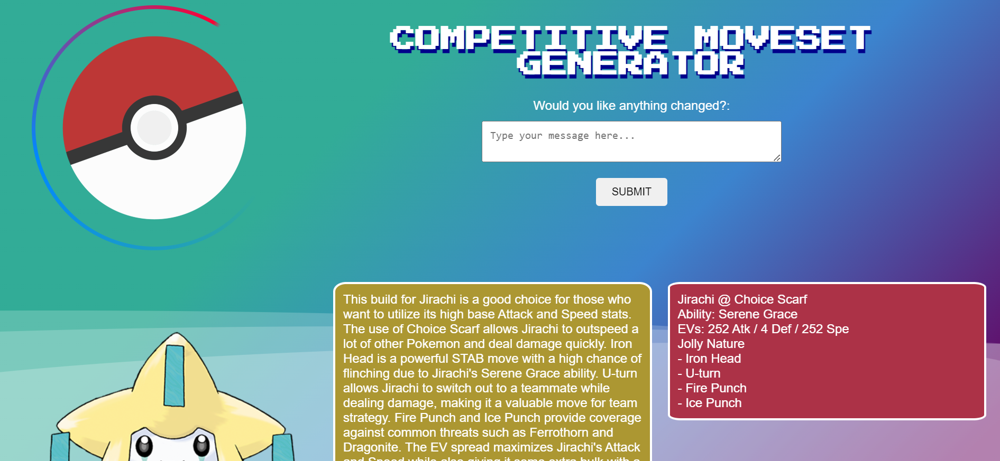

<h1>
  <br>
  <a href="https://github.com/Nelio-J/prg08-Taalmodel"></a>
  <br>
  Pokémon: Competitive Moveset Generator
  <br>
</h1>

<h4 align="center">An app built on top of <a href="https://openai.com/" target="_blank">OpenAI</a> to generate competitive viable Pokémon builds. .</h4>

<p>
  <a href="#key-features">Key Features</a> •
  <a href="#how-to-use">How To Use</a> •
  <a href="#credits">Credits</a>
</p>



## Key Features

* Powered by OpenAI
  - Use the power of GPT to quickly make strong Pokémon builds. It only takes the name of the Pokémon to get started.
* Tweak to your desire
  - With the use of chat history, you can hold conversations with the model. If you want anything about your generated build changed or an explanation of why the build is good, you can simply ask the model.
* Easily import and use the generated moveset
  - The model generates movesets using the standard Showdown format. You can go to [Pokémon Showdown](https://play.pokemonshowdown.com/) and easily import the moveset in the teambuilder.
* Secure requests
  - The application uses [Express](https://expressjs.com/) and [CORS](https://developer.mozilla.org/en-US/docs/Web/HTTP/CORS) to secure requests made to the server.

> **Notes**
> This app was build with GPT3.5. The newest Pokémon game GPT3.5 knows is Pokémon Sword and Shield. This means that the app will only generate movesets for Pokémon that are available in Pokémon Sword and Shield.
> 
> [client_react](https://github.com/Nelio-J/prg08-Taalmodel/tree/master/client_react) is a basic set-up for a front-end with React. It's currently unused and meant for future use.

## How To Use

To clone and run this application, you'll need [Git](https://git-scm.com) and [Node.js](https://nodejs.org/en/download/) (which comes with [npm](http://npmjs.com)) installed on your computer. From your command line:

```bash
# Clone this repository
$ git clone https://github.com/Nelio-J/prg08-Taalmodel.git

# Go into the repository
$ cd server

# Install dependencies
$ npm install

# Run the app
$ npm run dev
```

## Credits

This software uses the following open source packages:

- [Node.js](https://nodejs.org/)
- [Express](https://expressjs.com/)
- [Langchain](https://js.langchain.com/docs/use_cases/chatbots/quickstart)
- [OpenAI](https://platform.openai.com/docs/quickstart?context=node)


